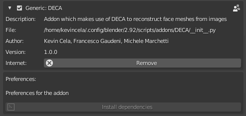
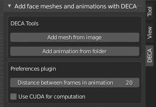

# Blender DECA plugin

Addon di Blender che consente di utilizzare la rete DECA per importare, a partire da un'immagine o da una serie di immagini, una mesh o animazione relativa alla faccia raffigurata. In particolare scegliendo una particolare immagine la rete verrà utilizzata per creare una singola mesh che contiene i dettagli e l'espressione relative al volto raffigurato, mentre dall'altro lato è possibile scegliere una cartella, contenente diversi frame relativi allo stesso volto, per realizzare un'animazione che vada ad interpolare tra le mesh realizzate a partire dai vari frame presi in considerazione.

## Setup

L'addon, che dovrà essere compresso in formato `.zip` e installato su Blender, è situato nella cartella `DECA`.

### Download modelli

I modelli preallenati per l'utilizzo della rete DECA devono essere situati nella cartella `data`, all'interno della cartella dell'addon. Per il corretto utilizzo della rete sono necessari, rispettivamente:

- Il modello della rete DECA, disponibile [nel seguente link](https://drive.google.com/file/d/1rp8kdyLPvErw2dTmqtjISRVvQLj6Yzje/view?usp=sharing). Il file così scaricato dovrà essere posizionato nella cartella `data` dell'addon.
- Il modello della rete [FLAME](https://flame.is.tue.mpg.de/downloads). Dello zip in particolare è necessario il file `generic_model.pkl`, che dovrà essere posizionato nella cartella `data` dell'addon.

Dopo aver scaricato i modelli, è possibile creare un zip dell'addon per il suo successivo caricamento in Blender.

Un link contenente il download di entrambi i modelli è disponibile qui di seguito: https://mega.nz/file/XNER1I6S#HfUhZEBHmE_gIKJ1a2IbS-DmVCrUn2i3cHvOkZJgaH0

### Installazione addon e relative dipendenze

Per funzionare correttamente, l'addon necessita di diverse dipendenze relative a python, non presenti di default nella distribuzione contenuta all'interno di Blender. Nel caso di Linux (e Mac?), l'addon offre l'opzione di installare in maniera semiautomatica tali dipendenze, mentre nel caso di Windows sarà necessaria un'installazione di natura manuale di tali dipendenze.

#### Linux e Mac

Se si utilizza come sistema operativo Linux o Mac l'addon contiene, tra le preferenze, un opzione che consente l'installazione di tutte le dipendenze necessarie per il corretto funzionamento, come è possibile vedere nella seguente immagine. Tale opzione è attiva solo nel caso in cui la distribuzione python non contiene le librerie richieste.



All'aggiunta in Blender l'addon tenta di importare le librerie necessarie. Nel caso in cui l'import avviene con successo le funzionalità dell'addon possono essere utilizzate, mentre in caso contrario l'addon non sarà utilizzabile e comparirà, tra le preferenze del plugin, l'opzione per installare tutte le dipendenze necessarie, che sono le seguenti:

- pip, setuptools
- pytorch (versione 1.7.1, CUDA 10.2)
- torchvision (versione 0.8.2, CUDA 10.2)
- face_aligment
- scipy
- chumpy
- skimage
- PyYAML
- opencv-python
- pytorch3d (versione precompilata funzionante con pytorch 1.7.1 e CUDA 10.2)

Utilizzando questo operatore, tutte le dipendenze saranno installate e il plugin potrà essere utilizzato.

**N.B.:** Per il corretto funzionamento di questa funzionalità è necessario avere una quantità sufficientemente alta di RAM disponibile, o in caso contrario il task verrà sospeso dal sistema operativo. Si noti, inoltre, che potrebbe essere necessario riavviare Blender dopo l'installazione delle dipendenze per un corretto funzionamento dell'addon.

#### Windows

Sfortunatamente, a causa dell'assenza delle versioni precompilate di pytorch3d per Windows e a causa della difficoltà nella compilazione nell'ambiente python di Blender, non contenente gli header e le librerie necessarie, l'operatore sopra descritto non può essere applicato su tale sistema operativo. Si suggerisce in questo caso l'utilizzo di [Anaconda](https://www.anaconda.com/products/individual) per creare un environment di Python che verrà in seguito collegato alla distribuzione Python di blender. La procedura può essere riassunta nei seguenti step:

- Installazione di Anaconda su Windows per la creazione e gestione dell'environment: https://anaconda.org/
- Creazione di un nuovo ambiente su cui verranno installate le dipendenze: 
    ```conda create --name blender python=3.7.7```
    In questo caso il nome dell'environment creato sarà blender, ma tale nome può essere scelto liberamente. Per il corretto funzionamento dell'environment, la versione di python usata deve coincidere con quella usata da Blender (in questo caso Python 3.7.7)
- Attivazione dell'environment che sarà utilizzato:
    ```conda activate blender```
- Installazione delle dipendenze necessarie per la compilazione di pytorch3d:
    ```conda install -c pytorch pytorch=1.7.1 torchvision cudatoolkit=10.2```,
    ```conda install -c fvcore -c iopath -c conda-forge fvcore iopath```.
- Compilazione ed installazione di pytorch3d:
    ```pip install "git+https://github.com/facebookresearch/pytorch3d.git"```
- Creazione di un link tra la versione di python inclusa di Blender e quella dell'environment creato:
    ```cd <blender_python_path>```, 
    ```mklink /j python C:\Anaconda3\envs\blender```.
    (il path dell'environment potrebbe cambiare rispetto a quella qui presente). 
    Si consiglia di rinominare la cartella python precedentemente presente in blender, per avere la possibilità di ripristinare la distribuzione di python usata.
- Avvio di Blender da command line, che deve essere fatta all'interno dell'environment Anaconda (usare ```conda activate blender``` prima di avviare ```blender.exe```).

**N.B.:** Per la corretta compilazione di pytorch3d, è necessario avere installato Microsoft Visual C++ all'interno del sistema operativo.

## Uso del plugin

Una volta installato l'addon con le relative dipendenze, è possibile procedere con il suo utilizzo. Il plugin è situato come tab all'interno della sidebar di blender (che può essere attivata tramite l'uso del tasto `N`), come visibile nella seguente figura:



L'addon in sè presenta due impostazioni principali: la prima consente di definire i frame di distanza tra una mesh e la successiva durante la generazione dell'animazione, mentre la seconda consente di scegliere tra l'utilizzo della GPU (tramite CUDA) e della CPU (a seconda dell'opzione scelta, il device usato nella rete corrisponderà a `"cuda"` oppure a `"cpu"`).

Oltre alle preferenze, nel pannello sono presenti i due operatori che consentono, rispettivamente, di creare una mesh a partire da un'immagine e un'animazione a partire da una cartella di immagini. Entrambi gli operatori apriranno una finestra da cui si ha la possibilità di scegliere il file o la cartella contenente le immagini (che dovranno essere in formato `.jpg, .png, .bmp`). Dopo aver eseguito la scelta verrà invocata la rete, che genererà le mesh e produrrà l'output all'interno di Blender.

## Risultato animazione

